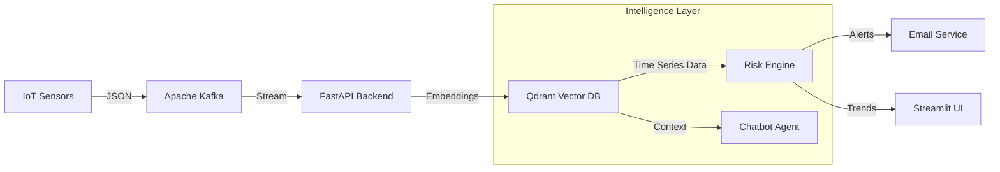

# 💧 Water Watch - Intelligent Water Quality Monitoring System


**Water Watch** is an advanced, real-time water quality monitoring platform that leverages **Vector Database (Qdrant)** technology not just for similarity search, but for **Time-Series Trend Analysis**. It ingests sensor data via **Kafka**, processes it into vector embeddings, and uses a retrieval-augmented generation (RAG) approach to forecast contamination risks.

---

## 🚀 Key Features

-   **🌊 Real-Time Ingestion**: High-throughput data streaming via **Apache Kafka**.
-   **🧠 Qdrant-Powered Intelligence**:
    -   **Vector Search**: Finds historically similar contamination events to predict current risks.
    -   **Time-Series Analysis**: Uses Qdrant's `scroll` API to retrieve and analyze recent 20+ data points for trend detection (pH dropping, turbidity rising, etc.).
-   **🤖 RAG Chatbot**: Ask questions like "How is the water quality at Site Bay?" and get answers grounded in real database records.
-   **📊 Premium Dashboard**: A beautiful, dark-mode **Streamlit** interface with glassmorphism and interactive Plotly charts.

---

## 🏗️ Architecture

The system follows a modern microservices-inspired architecture:



### Why Qdrant for Time Series?
Unlike traditional SQL databases, Qdrant allows us to:
1.  **Store Semantic Meaning**: We embed "murky water" text reports alongside numerical sensor data (Multimodal).
2.  **Hybrid Retrieval**: We filter by `site_id` and sort by `timestamp` to get strict time-series windows while maintaining the ability to search by vector similarity for anomaly detection.

---

## 🛠️ Setup & Installation

### Prerequisites
-   **Docker Desktop** (Must be running)
-   Python 3.10+

### 1. Start Infrastructure
We use Docker Compose to spin up the message broker and vector database.
```bash
docker-compose up -d
```
*Wait for containers (`kafka`, `qdrant`) to be healthy.*

### 2. Backend API
The brain of the operation.
```bash
# Install dependencies
pip install -r requirements.txt

# Start Server
uvicorn backend.main:app --reload
```
*API will run at `http://localhost:8000`*

### 3. Dashboard
The control center.
```bash
streamlit run dashboard/app.py
```
*UI will open at `http://localhost:8501`*

---

## 🧪 Verification
We have included a robust End-to-End test script to verify the entire pipeline (Ingestion -> Storage -> Retrieval).

```bash
python verify_deployment.py
```
**Expected Output:**
```
✅ Kafka Connection: OK
✅ Qdrant Storage: OK
✅ Risk Forecast (Trend Analysis): OK
🎉 SYSTEM FULLY OPERATIONAL
```

---

## 📂 Project Structure
-   `backend/`: FastAPI application, Services (Risk, Qdrant, Kafka).
-   `dashboard/`: Streamlit frontend with Premium UI.
-   `docker-compose.yml`: Infrastructure definition.

---

*Built for the Future of Water Safety.*
